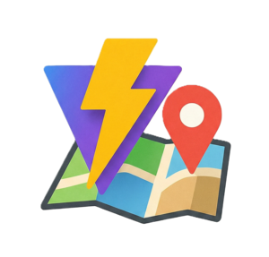

<div align="center">
  
  <h1>vite-plugin-google-maps <em>(Experimental)</em></h1>
</div>

[Read in English](./README.md)

Un plugin de Vite que simplifica la integración de Google Maps en aplicaciones React usando `@vis.gl/react-google-maps`.

## Características

- 🚀 **Auto-configuración**: Envuelve automáticamente tu app con `APIProvider`
- 🎯 **Opciones predeterminadas del mapa**: Configura los valores por defecto una vez, úsalos en todas partes
- 🛠️ **Herramientas para desarrolladores**: Panel de depuración integrado para desarrollo
- 📦 **Cero código repetitivo**: No necesitas configurar providers manualmente

## Instalación
```bash
pnpm install vite-plugin-google-maps
```

## Inicio Rápido

### 1. Configura el plugin

Agrega el plugin a tu `vite.config.ts`:
```typescript
import { defineConfig } from 'vite';
import react from '@vitejs/plugin-react';
import { GoogleMapsPlugin } from 'vite-plugin-google-maps';

export default defineConfig({
  plugins: [
    react(),
    GoogleMapsPlugin({
      apiKey: 'TU_CLAVE_API_GOOGLE_MAPS',
      libraries: ['places', 'marker'],
      debug: true, // Habilitar herramientas de desarrollo
      mapDefaults: {
        mapId: 'TU_MAP_ID',
        gestureHandling: 'greedy',
        defaultCenter: { lat: 40.7128, lng: -74.0060 },
        defaultZoom: 12,
        fullscreenControl: true,
        disableDefaultUI: false,
      }
    }),
  ],
});
```

### 2. Usa el componente Map

Importa y usa el componente `Map` preconfigurado:
```tsx
import { Map } from '@google-maps/map';
import { AdvancedMarker } from '@vis.gl/react-google-maps';

function App() {
  return (
    <div style={{ height: '100vh', width: '100%' }}>
      <Map>
        <AdvancedMarker position={{ lat: 40.7128, lng: -74.0060 }} />
      </Map>
    </div>
  );
}

export default App;
```

## Configuración de TypeScript
> [!WARNING]
> Para usar el componente `Map` con TypeScript, necesitas declarar el tipo del módulo. Crea un archivo `types.d.ts` (o cualquier `*.d.ts`) en tu proyecto:
>
> ```typescript
> // types.d.ts o vite-env.d.ts
> declare module "@google-maps/map" {
>  import React from "react";
>  import { Map as GoogleMapBase } from "@vis.gl/react-google-maps";
>  
>  export const Map: React.FC<React.ComponentProps<typeof GoogleMapBase>>;
> }
> ```
>
> Esto proporciona seguridad de tipos completa y autocompletado para las props del componente `Map`.

## Opciones de Configuración

### GoogleMapsPluginOptions

| Opción | Tipo | Predeterminado | Descripción |
|--------|------|----------------|-------------|
| `apiKey` | `string` | **requerido** | Tu clave API de Google Maps |
| `libraries` | `string[]` | `['places']` | Librerías de Google Maps a cargar |
| `debug` | `boolean` | `false` | Habilitar panel de herramientas para desarrolladores |
| `mapDefaults` | `MapDefaultOptions` | `{}` | Opciones predeterminadas para el componente Map |

### MapDefaultOptions

| Opción | Tipo | Predeterminado | Descripción |
|--------|------|----------------|-------------|
| `mapId` | `string` | - | ID del mapa para estilos personalizados |
| `gestureHandling` | `'cooperative' \| 'greedy' \| 'none' \| 'auto'` | `'auto'` | Cómo responde el mapa a los gestos |
| `defaultCenter` | `{ lat: number; lng: number }` | - | Posición inicial del centro del mapa |
| `defaultZoom` | `number` | `8` | Nivel de zoom inicial (0-22) |
| `fullscreenControl` | `boolean` | `false` | Mostrar botón de pantalla completa |
| `disableDefaultUI` | `boolean` | `false` | Deshabilitar todos los controles UI predeterminados |
| `zoomControl` | `boolean` | `true` | Mostrar controles de zoom (+/-) |
| `mapTypeControl` | `boolean` | `false` | Mostrar alternador mapa/satélite |
| `scaleControl` | `boolean` | `false` | Mostrar indicador de escala |
| `streetViewControl` | `boolean` | `true` | Mostrar muñeco de Street View |
| `rotateControl` | `boolean` | `false` | Mostrar control de rotación |

## Ejemplos de Uso

### Mapa Básico
```tsx
import { Map } from '@google-maps/map';

function BasicMap() {
  return <Map />;
}
```

### Sobrescribir Opciones Predeterminadas
```tsx
import { Map } from '@google-maps/map';

function CustomMap() {
  return (
    <Map
      defaultZoom={15}
      defaultCenter={{ lat: 51.5074, lng: -0.1278 }}
      gestureHandling="cooperative"
    />
  );
}
```

### Con Marcadores
```tsx
import { Map } from '@google-maps/map';
import { AdvancedMarker, InfoWindow } from '@vis.gl/react-google-maps';
import { useState } from 'react';

function MapWithMarkers() {
  const [open, setOpen] = useState(false);

  return (
    <Map>
      <AdvancedMarker
        position={{ lat: 40.7128, lng: -74.0060 }}
        onClick={() => setOpen(true)}
      />
      {open && (
        <InfoWindow
          position={{ lat: 40.7128, lng: -74.0060 }}
          onCloseClick={() => setOpen(false)}
        >
          <div>Ciudad de Nueva York</div>
        </InfoWindow>
      )}
    </Map>
  );
}
```

### Múltiples Mapas con Diferentes Configuraciones
```tsx
import { Map } from '@google-maps/map';

function MultipleMaps() {
  return (
    <div>
      {/* Usa valores predeterminados del plugin */}
      <Map style={{ height: '50vh' }} />
      
      {/* Configuración personalizada */}
      <Map
        style={{ height: '50vh' }}
        defaultCenter={{ lat: 48.8566, lng: 2.3522 }}
        defaultZoom={10}
      />
    </div>
  );
}
```

## Herramientas para Desarrolladores

Cuando `debug: true` está habilitado, aparece un panel de herramientas en la esquina inferior derecha mostrando:

- **Clave API**: Primeros 5 caracteres de tu clave API
- **Librerías**: Librerías de Google Maps cargadas
- **Estado del Mapa**: Si el mapa ha cargado o no
- **Nivel de Zoom**: Nivel de zoom actual
- **Centro**: Coordenadas del centro del mapa actual
- **Posición del Mouse**: Coordenadas del cursor en tiempo real
- **Posición del Clic**: Últimas coordenadas clicadas con dirección geocodificada
- **Botón Copiar**: Copiar coordenadas clicadas al portapapeles
- **Tipo de Mapa:** `mapTypeId` actual (roadmap, satellite, hybrid, terrain)
- **Map ID:** `mapId` activo en uso
- **Gesture Handling:** Modo de interacción actual (auto, greedy, none, etc.)
- **Tilt:** Ángulo de inclinación actual del mapa
- **Heading:** Ángulo de rotación actual
- **Bounds:** Límites visibles actuales del mapa (norte, sur, este, oeste)
- **Botón Copy Config:** Copia la configuración completa del mapa (center, zoom, tilt, heading, mapId, typeId, bounds)
- **Botón My Location:** Centra el mapa usando la geolocalización del navegador
- **Botón Reset:** Restaura la configuración inicial del mapa


## Cómo Funciona

1. **Auto-envoltorio**: El plugin envuelve automáticamente tu app React con `APIProvider` en `main.tsx`
2. **Módulo Virtual**: Crea un módulo virtual `@google-maps/map` que exporta un componente `Map` preconfigurado
3. **Props Predeterminadas**: Combina los valores predeterminados del plugin con las props del componente (las props del componente tienen precedencia)

## Obtener una Clave API de Google Maps

1. Ve a [Google Cloud Console](https://console.cloud.google.com/)
2. Crea un nuevo proyecto o selecciona uno existente
3. Habilita la **Maps JavaScript API**
4. Ve a **Credenciales** y crea una clave API
5. (Opcional) Restringe tu clave API por seguridad

[Más información](https://developers.google.com/maps/documentation/javascript/get-api-key)

## Solución de Problemas

### El mapa no carga

- Verifica que tu clave API sea correcta
- Comprueba que la Maps JavaScript API esté habilitada en Google Cloud Console
- Abre la consola del navegador para ver mensajes de error

### Errores de TypeScript

- Asegúrate de que `@vis.gl/react-google-maps` esté instalado
- Verifica que tu `tsconfig.json` incluya el directorio del plugin

### Las herramientas de desarrollo no aparecen

- Verifica que `debug: true` esté en las opciones del plugin
- Comprueba que estés usando el componente `Map` de `@google-maps/map`

## Licencia

MIT

## Contribuir

¡Las contribuciones son bienvenidas! No dudes en enviar issues o pull requests.

## Relacionado

- [@vis.gl/react-google-maps](https://visgl.github.io/react-google-maps/)
- [Google Maps JavaScript API](https://developers.google.com/maps/documentation/javascript)
- [Vite Plugin API](https://vitejs.dev/guide/api-plugin.html)
